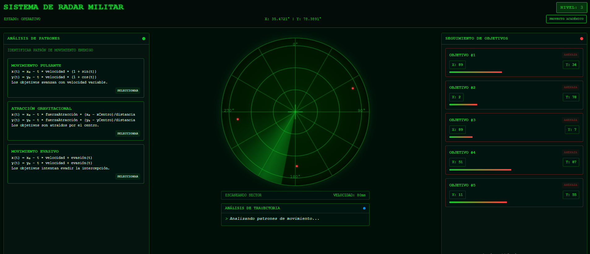
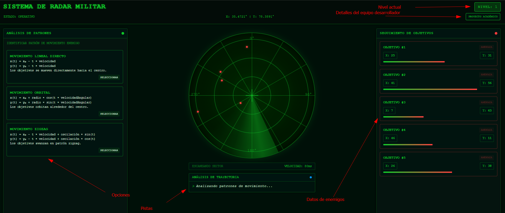
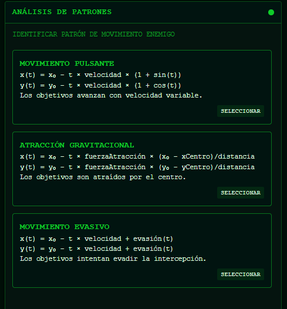
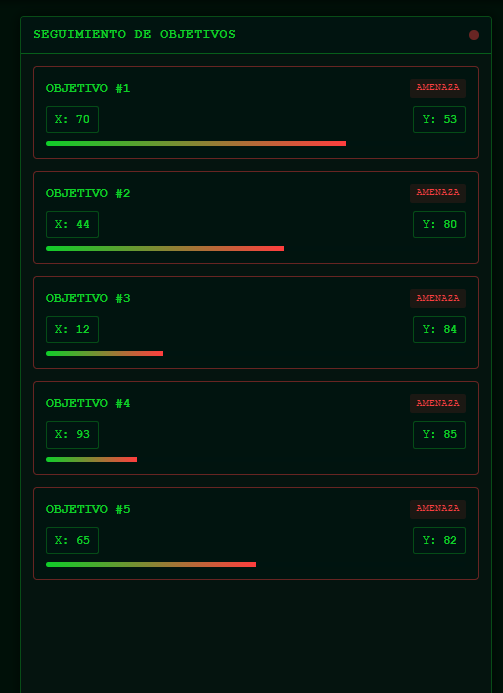
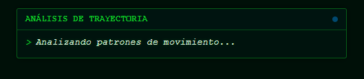
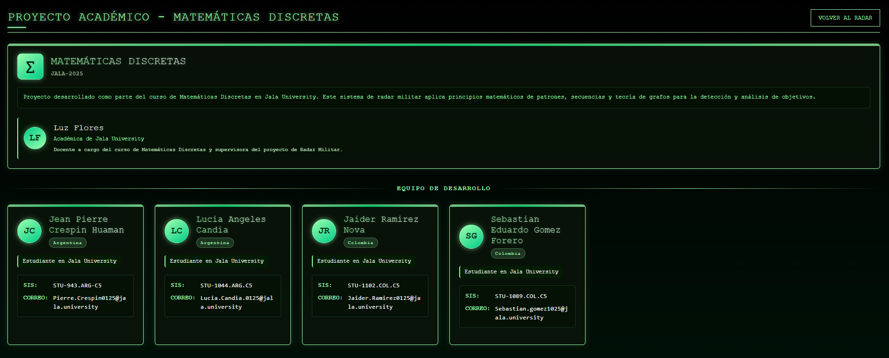

# Radar Militar - Proyecto Académico de Matemáticas Discretas



## Descripción del Proyecto

El Sistema de Radar Militar es una aplicación web desarrollada como proyecto académico para el curso de Matemáticas Discretas en Jala University. Esta aplicación simula un sistema de radar militar que permite identificar patrones de movimiento enemigo aplicando conceptos matemáticos discretos.

### Características Principales

- **Visualización de Radar en Tiempo Real**: Simula el funcionamiento de un radar militar con barrido rotatorio y detección de objetivos.
- **Análisis de Patrones de Movimiento**: Implementa algoritmos para identificar y predecir movimientos basados en secuencias y patrones matemáticos.
- **Seguimiento de Objetivos**: Muestra información detallada de los objetivos detectados incluyendo coordenadas y distancia.
- **Sistema de Niveles**: Presenta desafíos matemáticos de dificultad progresiva.

## Fundamentos Matemáticos

El proyecto implementa y demuestra la aplicación práctica de varios conceptos de matemáticas discretas:

- **Secuencias y Patrones**: Detección de regularidades en movimientos enemigos.
- **Teoría de Grafos**: Modelado de trayectorias y posibles rutas de movimiento.
- **Lógica Matemática**: Sistemas de validación para la identificación correcta de patrones.
- **Recursividad**: Algoritmos de predicción de posiciones futuras.

## Arquitectura del Proyecto

La aplicación está construida con Angular, siguiendo una arquitectura de componentes modular:

- **Componente Radar**: Núcleo principal de la aplicación, visualiza el radar y gestiona la interacción del usuario.
- **Componente Equipo-Proyecto**: Presenta información sobre el proyecto académico y el equipo de desarrollo.
- **Servicios de Datos**: Maneja la generación y gestión de patrones matemáticos.

## Tecnologías Utilizadas

- **Frontend**: Angular 19, TypeScript, SCSS
- **Estilo Visual**: Diseño inspirado en interfaces militares con estética tecnológica
- **Patrones de Diseño**: Componentes Standalone, Servicios Inyectables, Observables

## Guía de Instalación

### Prerrequisitos
- Node.js (versión 18.x o superior)
- Angular CLI (versión 19.0.0)

### Instalación

1. Clone el repositorio:
```bash
git clone https://github.com/tu-usuario/radar-militar.git
cd radar-militar
```

2. Instale las dependencias:
```bash
npm install
```

3. Inicie el servidor de desarrollo:
```bash
ng serve
```

4. Abra su navegador y visite `http://localhost:4200/`

## Guía de Uso

1. **Pantalla Principal del Radar**:
   - Observe el radar giratorio que detecta objetivos enemigos.
   - El panel izquierdo muestra opciones de análisis de patrones.
   - El panel derecho presenta información de los objetivos detectados.

2. **Análisis de Patrones**:
   - Examine los patrones de movimiento mostrados en el panel izquierdo.
   - Seleccione el patrón que mejor describa el movimiento observado.
   - Reciba retroalimentación instantánea sobre su elección.

3. **Niveles de Dificultad**:
   - La aplicación presenta diferentes niveles con patrones matemáticos cada vez más complejos.
   - Complete cada nivel para avanzar al siguiente desafío.

## Estructura del Código

```
src/
├── app/
│   ├── app.component.ts
│   ├── app.component.html
│   ├── app.routes.ts
│   └── app.config.ts
├── core/
│   ├── radar-militar/
│   │   ├── radar-militar.component.ts
│   │   ├── radar-militar.component.html
│   │   └── radar-militar.component.scss
│   └── equipo-proyecto/
│       ├── equipo-proyecto.component.ts
│       ├── equipo-proyecto.component.html
│       └── equipo-proyecto.component.scss
└── styles.scss
```

## Equipo de Desarrollo

El proyecto fue desarrollado por estudiantes de Jala University:

- **Jean Pierre Crespin Huaman** (Argentina) - STU-943.ARG-C5
- **Lucia Angeles Candia** (Argentina) - STU-1044.ARG.C5
- **Jaider Ramirez Nova** (Colombia) - STU-1102.COL.C5
- **Sebastian Eduardo Gomez Forero** (Colombia) - STU-1089.COL.C5

## Supervisión Académica

Este proyecto fue supervisado por **Luz Flores**, Académica de Jala University, como parte del curso de Matemáticas Discretas.

## Contribuciones

Este es un proyecto académico, pero las contribuciones son bienvenidas. Si desea contribuir:

1. Haga un fork del repositorio
2. Cree una rama para su función (`git checkout -b feature/nueva-funcion`)
3. Realice sus cambios y haga commit (`git commit -m 'Añadir nueva función'`)
4. Envíe a la rama (`git push origin feature/nueva-funcion`)
5. Abra un Pull Request

## Licencia

Este proyecto es de código abierto y está disponible bajo la Licencia MIT.

## Capturas de Pantalla

### Vista Principal del Radar


### Análisis de Patrones


### Seguimiento de Enemigos


### Pistas


### Equipo del Proyecto


---

*Este proyecto fue desarrollado como ejercicio académico para demostrar aplicaciones prácticas de conceptos de matemáticas discretas en un contexto de simulación militar.*
